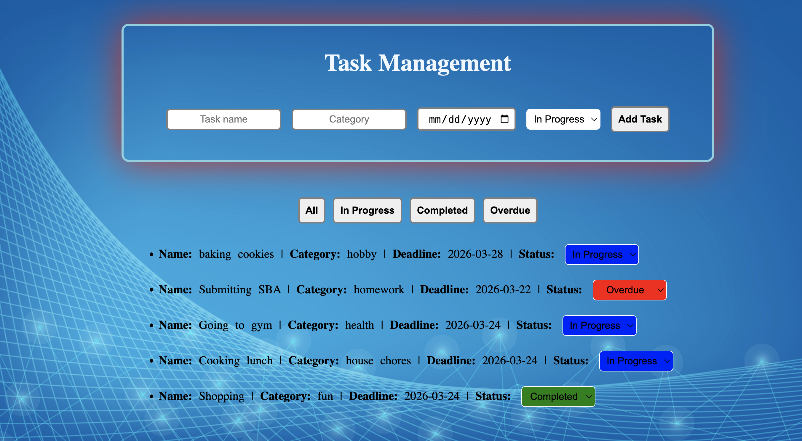

# Task Management App

### Description

This is a Task Management App that allows users to add tasks with deadlines, assign categories, and update the status of each task.

### What I learned

Building this Task Management App was challenging and rewarding. Through this project, I improved my understanding of: Javascript DOM Manipulation - creating list items, buttons and dropdowns, Event Listeners - handling click event for filter buttons and change events for task status dropdowns, Styling - changing the color of tasks based on status, so the status stands out.

### Resources

MDN, W3schools, AI tools, YouTube tutorials

